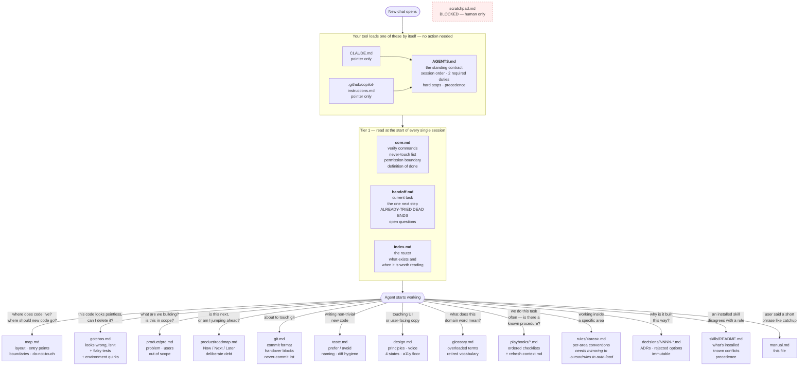
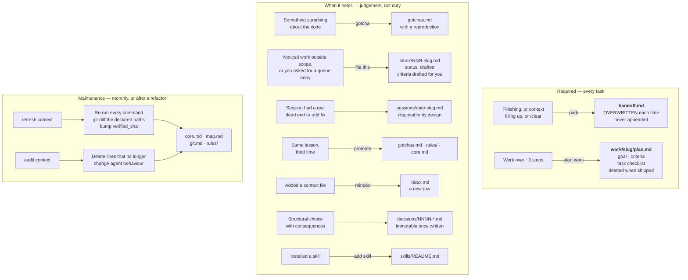

# Driving manual

How to actually use this thing.

None of the phrases below are magic commands — they're plain English that the
context files teach the agent to recognise. Variations work fine. You don't have
to say them exactly.

Keep this open for the first week. After that you'll use four of them.

---

## Quick reference

| Say this | And you get |
|---|---|
| `catchup` | Where we are, the next step, what's already been ruled out |
| `park` | The handoff written now, before you close or clear |
| `give @.ctx/git.md` | Copy-paste commit blocks, messages written for you |
| `add to inbox: X` | X queued as a real item, criteria drafted for you |
| `file this` | The thing you just noticed goes in the inbox, not the diff |
| `ready NNN` | A drafted item confirmed and moved into the pick-up queue |
| `groom inbox` | Every unspecified item given criteria, in one sweep |
| `start work on X` | A plan and task checklist that survives a context reset |
| `grill me` | Interviewed until a vague idea is actually specified |
| `pick up NNN` | An inbox item started, or refused if it's too vague |
| `reindex` | Files with no index row found, before they go invisible |
| `refresh context` | Every command re-run, every drifted doc flagged |
| `audit context` | Lines that no longer earn their place deleted |
| `gotcha` | The thing that just bit you recorded with a reproduction |
| `what do you actually know?` | The agent's beliefs stated, so you can catch a stale file |
| `promote` | A lesson that keeps recurring moved somewhere permanent |
| `add skill X` | An installed external skill registered, with its conflicts |

---

## Every day

### `catchup`

The agent reads `handoff.md`, the newest `work/` folder, and the last couple of
session notes, then tells you what we're doing, the next step, what's been ruled
out, and what it's unsure about.

Say it at the start of any session that isn't a fresh start. Cheapest possible
way to avoid re-explaining yourself.

### `park`

Writes `handoff.md` right now: current task, single next step, dead ends, open
questions.

Before you close the laptop, before `/clear`, and **the moment the context bar
starts looking full**. A session that dies unexpectedly takes everything with it
unless this ran first.

### `give @.ctx/git.md`

The agent reads your uncommitted changes and replies with copy-paste `git add`
and `git commit` blocks — one per logical commit, messages in this project's
style, and nothing else in the reply.

You run them. The agent never commits.

### `add to inbox: <anything>`

You describe it in a sentence; the agent writes the item. It drafts the
acceptance criteria from what you said, files it as `drafted`, and shows you the
criteria in three lines so you can confirm in a word:

> *"add to inbox: bulk CSV export for the reports page"*
>
> Filed `014-bulk-csv-export.md` — `drafted`.
> - [ ] `GET /export?format=csv` returns a CSV for any list endpoint
> - [ ] Exports over 10k rows stream rather than buffer
> - [ ] `pnpm test:export` passes
> Say `ready 014` to confirm, or tell me what's wrong.

The criteria are a proposal, labelled as one. An agent won't pick up its own
draft unsupervised — that confirmation is the whole checkpoint.

### `file this`

Same thing, aimed at whatever you just spotted mid-task, so it goes in the queue
instead of widening the current diff. Use it every single time you notice
something unrelated. It's the whole trick to keeping changes reviewable.

**The inbox is for work you're *not* doing right now.** If you want something
done in this session, just say it — filing it first is pure bureaucracy.

### `ready NNN`

Confirms a drafted item and moves it into the pick-up queue. `ready 014 017 021`
works for a batch.

Correcting a criterion is worth more than adding one — the agent's wrong
assumption is what it would have built against.

### `groom inbox`

Sweeps every item still sitting at `new`, drafts criteria for each, and gives
you one list to approve. Whatever genuinely can't be specified stays `new` with
a question attached, and the agent says which and why.

Run it before a planning session. A queue of unspecified items is a queue nobody
can act on.

---

## Starting work

### `start work on <thing>`

Opens `work/<slug>/plan.md` — goal, acceptance criteria, and a task checklist
where each item names the file it touches and the command that proves it.

Worth it for anything over about three steps. The checklist is what survives a
context reset; a plan that lives only in the chat does not.

### `grill me`

The agent interviews you one question at a time, each with a recommended answer,
until the thing is actually specified. Then it writes the result down.

Use it when you have an idea rather than a plan. Vagueness is what the session
is for.

### `pick up <NNN>`

Takes the inbox item, checks the acceptance criteria are real, marks it active,
starts. If the criteria are vague it stops and asks instead of guessing — that
refusal is a feature, not an obstacle.

Pointing at an item by number counts as confirming it, so this works on a
`drafted` one too. The agent restates the criteria it's building against before
writing any code, so a wrong draft dies in one line rather than one hour.

`pick up next` takes the highest-priority `ready` item instead.

---

## Keeping it honest

### `reindex`

Checks every file in `.ctx/` has a row in `index.md`, and that no row points at
a file that's gone. Files missing from the index are invisible to future
sessions.

Say it after adding or deleting context files.

### `refresh context`

Re-runs every verify command, checks git for files renamed or deleted out from
under the docs, and reports what's drifted.

Monthly, or after a big refactor. **This is the one people skip, and skipping it
is how the whole thing quietly turns into lies.**

### `audit context`

The pruning pass. For every line, asks: *would removing this change what the
agent does?* If no, it goes.

The only operation that makes the system smaller. Without it, context files only
grow, and eventually cost more than they return.

### `gotcha`

Records the thing that just bit you into `gotchas.md`, with a reproduction — the
retry loop that looks pointless, the test that needs a flag, the sleep that's
load-bearing.

Say it the moment it happens. In an hour you'll have forgotten the detail worth
writing down.

### `what do you actually know?`

The agent states what it believes about this project from `.ctx/` alone, and
flags which parts are verified versus still placeholders.

Run it occasionally. If it confidently tells you something wrong, you've found a
stale file — which is exactly the failure this system exists to catch.

---

## Rarely

### `promote`

Moves a lesson that's now appeared three times out of `sessions/` into somewhere
permanent — `gotchas.md`, a rule, or `core.md`. Session notes are disposable;
promoted knowledge is maintained.

### `add skill <name>`

Registers an external skill you've installed in `skills/README.md`, so the agent
knows it exists and how it ranks against this project's rules.

### `set up the project context`

First-run setup. Needed once. The agent reads your repo, runs your commands, and
then writes its answers into two forms in `setup/` for you to correct — the
project, then the house rules. Form 1 opens by asking **which parts of `.ctx/`
you actually want**; whatever you skip gets deleted rather than left half-filled.

Nothing is written until both forms are back, and then everything is written at
once. Handing a form back untouched is a valid answer; every field is already
filled in with a recommendation. Say `grill me` if you'd rather answer in chat.

Deletes `starter.md` and `setup/` when it finishes, and hands you the loop below.

---

## The map

### 1. What the agent reads, and what makes it reach for each file

### 2. What the agent writes, and what triggers it

### 3. How one idea travels through the system

This is the diagram worth internalising. Nothing jumps a stage, and only the
lessons that keep recurring earn a permanent home.

```mermaid
flowchart LR
    IDEA(["A thought"]) --> BRAIN["<b>product/brainstorm.md</b><br/>unconfirmed<br/>agent may discuss<br/><b>may NOT build from it</b>"]

    BRAIN -->|"you approve it<br/>— human only"| PRD["<b>product/prd.md</b><br/>committed intent"]
    BRAIN -->|"you reject it"| PARKED["Parked list<br/>WITH the reason<br/>so it stays rejected"]

    PRD --> ROAD["<b>product/roadmap.md</b><br/>Now / Next / Later"]
    ROAD --> INBOX["<b>inbox/NNN.md</b><br/>you describe it<br/>the agent files it"]

    INBOX -->|"agent drafts<br/>the criteria"| DRAFTED["status: drafted<br/>a proposal,<br/><b>labelled as one</b>"]
    INBOX -->|"too vague to draft<br/>— asks, does not guess"| NEW["status: new<br/>+ the question"]
    NEW -->|"groom inbox"| DRAFTED

    DRAFTED -->|"ready NNN"| READY["status: ready"]
    DRAFTED -->|"pick up NNN<br/>— pointing at it<br/>is confirming it"| ACTIVE
    READY -->|"pick up NNN"| ACTIVE["status: active"]
    ACTIVE -->|"over 3 steps"| WORK["<b>work/slug/plan.md</b><br/>task checklist<br/>survives a reset"]
    ACTIVE -->|"small"| DIRECT["Just do it"]

    WORK --> REVIEW["status: review<br/>human closes it"]
    DIRECT --> REVIEW
    REVIEW --> SESSION["<b>sessions/note.md</b><br/>what changed<br/>how verified<br/>dead ends"]

    SESSION -->|"same lesson<br/>a third time"| PERM["<b>gotchas.md</b> · <b>rules/</b> · <b>core.md</b><br/>durable, maintained"]
    SESSION -->|"one-off"| PRUNE(["Pruned later<br/>— that's fine"])

    HAND["<b>handoff.md</b><br/>rewritten at every<br/>session boundary"]
    ACTIVE -.-> HAND
    WORK -.-> HAND
```

---

## Every file, what it does, and whether it changes

**Folders with a `_TEMPLATE.md` are folders the agent fills by copying that
template.** You never edit `_TEMPLATE.md` itself; it's the blank form. The
leading underscore also keeps it out of the index checker.

### Loaded every session

| File | What it's for | Filled by setup? | Changes over time |
|---|---|---|---|
| `core.md` | Verify commands, hard rules, what the agent may do without asking | **Yes, heavily** | Rarely — only when commands or boundaries change |
| `index.md` | The router. What exists and when to read it | Rows added | Every time you add a context file |
| `handoff.md` | Where the last session stopped, and what it ruled out | Written at the end | **Every session** |

### Reference — read when relevant

| File | What it's for | Filled by setup? | Changes over time |
|---|---|---|---|
| `map.md` | Where code lives, which boundaries matter | **Yes**, derived from your repo | On refactors and restructures |
| `git.md` | Commit style, branch names, the commit handover rule | **Yes**, derived from `git log` | Rarely |
| `gotchas.md` | Code that looks wrong and isn't | No — starts empty on purpose | Grows from real failures |
| `taste.md` | Code preferences a linter can't catch | Only if you answer round 3 | When agent output feels foreign |
| `glossary.md` | Words that mean something specific here | Only if your domain overloads terms | When vocabulary shifts |
| `design.md` | UI, copy, interaction, accessibility floor | Only if there's a UI | As the design system evolves |
| `skills/README.md` | External skills installed, and their conflicts | Only if you have any | When you add or remove a skill |
| `manual.md` | This file | No | If you add your own commands |

### Intent — why, not how

| File | What it's for | Filled by setup? | Changes over time |
|---|---|---|---|
| `product/prd.md` | What we're building, for whom, what's out of scope | **Yes**, from the round 2 interview | When scope genuinely changes |
| `product/roadmap.md` | Now / Next / Later, and deliberate debt | **Yes**, from the build interview | As priorities move |
| `product/brainstorm.md` | Ideas before they're decided. Agents never build from it | Maybe | Constantly. Allowed to be messy |

### Procedure

| Path | What it's for | Filled by setup? | Changes over time |
|---|---|---|---|
| `playbooks/refresh-context.md` | The refresh / audit / record operations | No — ships ready to use | No |
| `playbooks/_TEMPLATE.md` | Blank form for a repeatable procedure | No | You add playbooks as patterns emerge |
| `rules/_TEMPLATE.md` | Blank form for per-area conventions | **Yes** — agent creates `rules/<area>.md` | As conventions form. **Needs mirroring to `.cursor/rules/` to auto-load** |

### Work and history

| Path | What it's for | Filled by setup? | Changes over time |
|---|---|---|---|
| `inbox/README.md` | How the queue works, and who may set which status | No | No |
| `inbox/_TEMPLATE.md` | Blank form for one task, bug, or request. **The agent fills it; you confirm** | First items created | Constantly |
| `work/_TEMPLATE.md` | Blank form for a change in flight | No | One folder per multi-step task, deleted when shipped |
| `sessions/_TEMPLATE.md` | Blank form for a session note | One note written | Grows, then gets pruned. Disposable by design |
| `decisions/_TEMPLATE.md` | Blank form for an ADR | Only if something structural was decided | Rarely. Immutable once written — supersede, don't edit |

### Yours, optional, and temporary

| Path | What it's for | Filled by setup? | Changes over time |
|---|---|---|---|
| `scratchpad.md` | Your space. The agent is blocked from reading it | No | Whenever you like. Nothing here is authoritative |
| `README.md` | How the system works and why. Read before changing it | No | No |
| `manual.md` | This file | No | If you add your own commands |
| `adapters/` | Templates for the root files — `AGENTS.md`, `CLAUDE.md`, `.cursorignore`, and so on | **Copied out** for the tools you named | Only when you add a new AI tool |
| `skills/` | The setup procedure | Runs once | No. Copy to `.claude/skills/` or `.agents/skills/` to make it auto-trigger |
| `setup/` | Two forms the agent pre-fills for you to correct — the project, then house rules | **Written by the agent, corrected by you** | **Deleted when setup finishes** |
| `hooks/` | Two optional Node scripts, opt-in. Delete freely | No — mentioned, not installed | No |
| `starter.md` | The one-time setup guide | **Deletes itself when finished** | Gone |

---

## The four that matter

If you remember nothing else: **`catchup`** to start, **`park`** to stop,
**`give @.ctx/git.md`** to commit, **`refresh context`** once a month.

Everything else is optional convenience. Those four are the loop.
