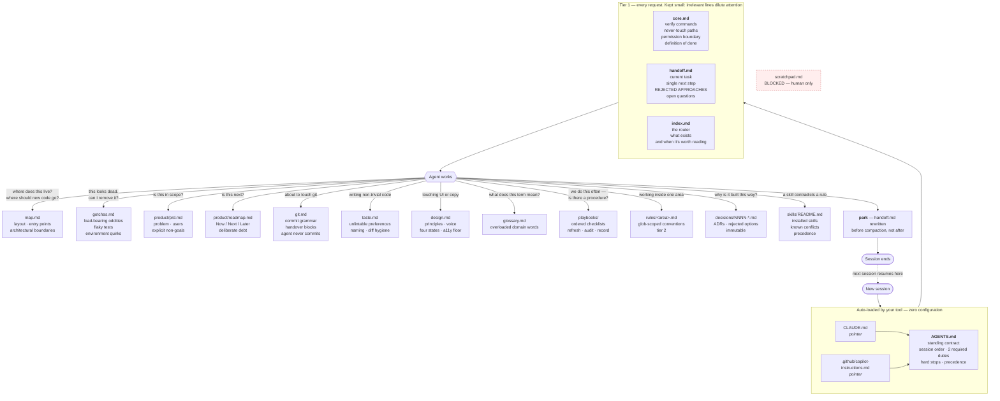
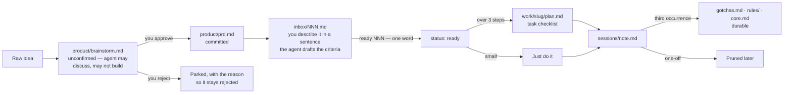

# bookkeeper

**Context engineering for AI coding agents.** A tiered, self-maintaining context
layer with provenance-tracked staleness detection, deterministic enforcement,
and automatic session bookkeeping. Ships as a zip. Zero dependencies.

[](https://github.com/OWNER/bookkeeper/releases/latest)
[](https://github.com/OWNER/bookkeeper/releases)
[](LICENSE)


<!-- Replace OWNER above before publishing. -->

---

## The problem

Inference is stateless. Your agent reconstructs its entire understanding from
the context window on every request, and everything not in that window is
guessed. The observable symptoms:

- Architecture, test commands, and deploy story re-explained daily.
- Load-bearing code deleted because it looked dead.
- Rejected approaches re-proposed with full confidence.
- `"tests pass"` reported without execution.
- Unrequested commits.
- `CLAUDE.md` past ~200 lines: adherence collapses, every line dilutes every other.
- Compaction fires mid-task; the thread evaporates.

The weights are fixed. The context window is the only lever, and almost nobody
engineers what goes into it.

## The difference

Same task, second session. Without:

```
you    fix the flaky checkout test
agent  Let me run the suite to see what's happening.
       [runs everything — four minutes]
       I'll add a retry wrapper around the readback.
you    we tried that last week, it didn't work
agent  Understood. What about mocking the clock?
you    also tried. and don't commit anything
agent  [commits]
```

With:

```
you    catchup
agent  Mid-way through the flaky checkout test.
       Root cause: the vendor returns 200 before the record is readable
       — gotchas.md, verified 2026-08-14.
       Already rejected: retry wrapper, clock mocking.
       Next step: move the readback behind the existing backoff client.
       Verify with `pnpm vitest run tests/checkout` — not the full suite.
       I don't run git here; I'll write the commit message for you.
```

## Install

```
1. Download ctx.zip from the latest release
2. Unzip it in your project root
3. Tell your agent:  read .ctx/starter.md and follow it
```

Setup reads the repo, executes your build and test commands to confirm they
work, and then asks about what it couldn't derive — as **two forms it has
already filled in**:

1. **The project.** Opens by asking which parts of `.ctx/` you actually want —
   PRD or not, design doc or not, glossary or not. Anything you skip is deleted
   rather than left sitting there half-filled.
2. **The house rules.** May it commit, emojis, comment and TODO policy, test
   expectations, which areas deserve their own rule file. Shaped by what you
   kept, so sections that don't apply to you aren't in it.

Then everything is written at once — context files, first backlog, adapters at
your repo root — and setup deletes itself. Ten minutes.

Every field carries a recommendation, so a form returned untouched still
produces a working `.ctx/`. That's the point: a blank form is homework and gets
abandoned, while a filled one is a diff to review. Prefer to talk? Say
`grill me` and the same questions arrive one at a time in chat.

## What your agent actually reads

Three tiers with progressive disclosure. The always-loaded surface stays small;
everything else is retrieved on demand through a single router.



Every arrow is a question the agent would otherwise answer by guessing,
grepping, or asking you again.

## Automatic bookkeeping

The differentiator. Most context templates are read-only — you write them, the
agent consumes them, they go stale. This one is **written back to** as a matter
of protocol, and the write path is deliberately short.

**Required, every task.** Update `handoff.md` before finishing or compacting.
Keep a checklist in `work/<slug>/` for anything over three steps.

**Judgement, not duty.** Gotchas with reproductions, inbox items for
out-of-scope work, session notes, promotion of a lesson on its third occurrence,
an index row for any new file.

Two required duties rather than six is a deliberate cut. Process compliance
appended after task completion is the category models drop first, and it drops
hardest when context is full — precisely when you needed it. A short list that
gets followed beats a long list that produces four half-maintained files.

**Anti-accumulation is built in.** Session notes are disposable by default. A
lesson earns a permanent home only on recurrence, with a reproduction or a named
test behind it. Retrieval precision degrades as a corpus grows, so `audit` — the
operation that deletes lines failing the test *"would removing this change what
the agent does?"* — matters as much as anything that writes.

## Enforcement: rules ask nicely, hooks enforce

Written instructions are probabilistic. Frontier models obey standing policy
documents roughly 36% of the time. So the things that must hold are moved out of
prose and into mechanisms the model doesn't get a vote on.

| Mechanism | What it does | Layer |
|---|---|---|
| `permissions.deny` in `.claude/settings.json` | Blocks `git add/commit/push` and reads of `scratchpad.md` at the tool layer. Evaluated deny → ask → allow; applies before folder trust, so it works on first clone | Native, no script |
| `.cursorignore` | Blocks Cursor's file tools and `@`-mentions from the scratchpad | Native, no script |
| `Stop` / `stop` hook | Fires at session end. If source changed and `handoff.md` didn't, the agent is told to write it. Loop-protected via `stop_hook_active` and `loop_count`; uses `additionalContext` over `decision: "block"` so a forgotten handoff isn't rendered as an error you learn to dismiss | Opt-in, Node, zero deps |
| `sync-index.mjs --strict` | Fails CI when a `.ctx/` file has no `index.md` row — the one silent failure in the design, since unindexed files are invisible forever | CI, server-side |

Both hooks fail open on every path. A broken session-end hook degrades every
turn, so they're built to do nothing rather than harm.

Known limit, stated rather than hidden: none of these stop a subprocess that
opens a file directly. They raise the cost of an accident. They are not a
security boundary.

## How work moves



## Commands

| | |
|---|---|
| `catchup` | Where we are, the next step, what's ruled out |
| `park` | Write the handoff **now** — before you close or `/clear` |
| `give @.ctx/git.md` | Copy-paste commit blocks. You run them, never the agent |
| `add to inbox: X` | X queued as a real item, with criteria drafted for you |
| `refresh context` | Re-run every command, flag every drifted doc. Monthly |

A dozen more in `manual.md`: `file this`, `ready NNN`, `groom inbox`,
`start work on`, `grill me`, `pick up`, `reindex`, `audit context`, `gotcha`,
`promote`, `add skill`, and `what do you actually know?`.

**The queue is written by the agent, not by you.** Saying *"add to inbox: bulk
CSV export"* is the whole interaction — it writes the item, drafts acceptance
criteria from what you said, and shows them back in three lines so you confirm
with `ready 014` or correct one line. The criteria arrive labelled as a draft
and an agent won't act on its own draft unprompted, which is the difference
between proposing an answer and inventing one. Most queues rot because writing
a good ticket by hand is work; this one is written at the moment the most
context about it exists.

## Against a hand-written `CLAUDE.md`

| | `CLAUDE.md` | bookkeeper |
|---|---|---|
| Loading | Everything, every request | Tiered: always / glob-scoped / on-demand via router |
| Growth | Unbounded. Adherence collapses past ~200 lines | Budgeted tier 1; `audit` is a named shrink operation |
| Staleness | Undetectable | `describes:` + `verified_sha` frontmatter; git-diffable |
| Session state | None | `handoff.md` with rejected approaches, written pre-compaction |
| Multi-step work | Lives in the chat, dies with it | `work/<slug>/` checklist on disk |
| Task queue | None | `inbox/`, filed by the agent from one sentence, criteria drafted for you to confirm |
| Getting started | You write it from scratch | Two forms the agent fills in first; correcting beats authoring |
| Enforcement | Prose only | Native deny rules, opt-in hooks, CI gate |
| Portability | One vendor | One source, adapters generated per tool |
| Skill conflicts | Silent resolution | Declared precedence, registered conflicts |

## Anti-rot mechanisms

**Progressive disclosure.** Capacity isn't the constraint — frontier models track
thousands of simultaneous instructions. Signal-to-noise is. Irrelevant lines
crowd out relevant ones.

**Provenance in frontmatter.** `describes: [paths]` plus `verified_sha` makes
staleness mechanically detectable: diff the declared paths since that commit.
Judgement docs carry no `describes:`, because no diff validates taste.

**Executable checks over written rules.** If a linter, a type, or a test can
enforce it, that's where it goes. A rule is a request; a test is a fact.

## What this does, and doesn't

A controlled study across four agents and 138 real issues found repository
context files produced **no statistically significant change in correctness**,
while raising inference cost **20–23%**. Most projects in this space imply
otherwise. The honest claim:

- Puts what an agent **cannot** derive from your repo where it will look.
- Collapses rediscovery cost between sessions.
- Makes behaviour **auditable** — point at the ignored rule instead of guessing.

Both consequences are designed in: tier 1 stays small because you pay for it
every request with no measured correctness return, and enforcement moves to
mechanisms wherever one exists.

## Compared to

| | |
|---|---|
| **spec-kit, OpenSpec, BMAD** | Spec-driven workflows — per-feature, disposable. Different job; composes fine |
| **Memory Bank, Kiro steering** | Closest relatives. This adds tiering, staleness provenance, and a pruning operation |
| **Agent Skills** | Procedural, on-demand. This is declarative and standing. Register yours in `skills/README.md` |

## Who should use it

Anyone using a coding agent daily who has caught themselves typing *"we already
tried that."*

## Contributing

Filled-in real examples, and rules that earned their place by preventing an
actual failure. If a linter, a type, or a test can enforce it, it belongs there
instead of in prose.

## License

MIT-0. No attribution required, because you'll copy these files into your own
repo and won't take the LICENSE with them.
# bookkeeper

# bookkeeper

