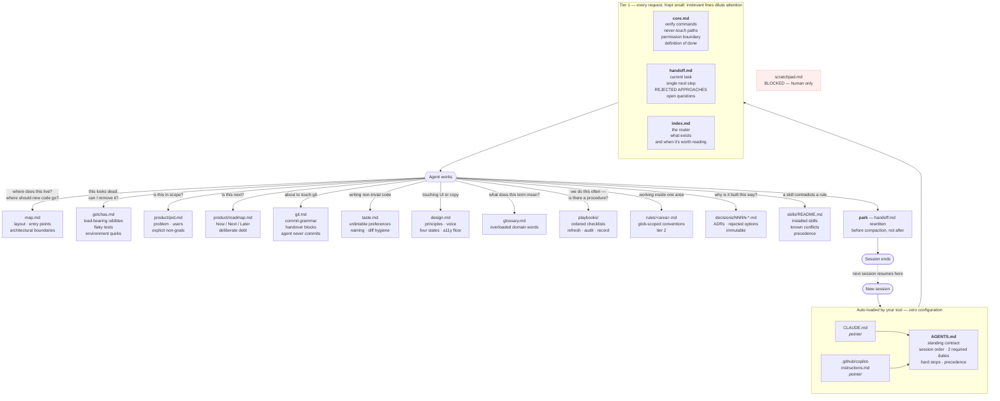
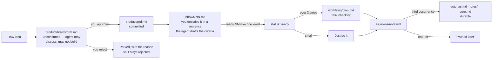

# Architecture and Diagrams

This document contains the Mermaid diagrams used across the repository, along with their source definitions.

## 1. Context Architecture & Information Flow

Corresponds to `assets/architecture.svg` in [README.md](file:///e:/development/bookkeeper/README.md).

---

## 2. Work Lifecycle & State Transitions

Corresponds to `assets/work-flow.svg` in [README.md](file:///e:/development/bookkeeper/README.md).

